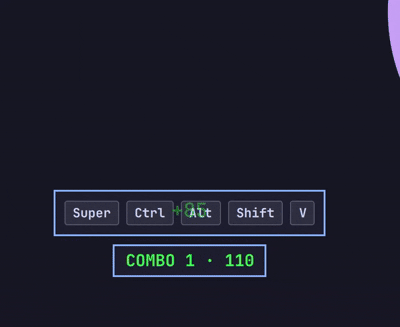

# Omarchy Key Visualizer

A tiny [Omarchy](https://omarchy.org/) plugin that shows the keys you press
on screen — no keycap images, no fuss. Great for keybinding tutorials, demos
and screencasts.

## Preview




## Install

```bash
omarchy plugin add https://github.com/felixzsh/omarchy-key-visualizer --enable
```

You'll be asked where to put the bar widget (or add `--section right`).
That's it: the panel shows the keys and the keyboard glyph in the bar opens
the menu. On first load the plugin adds a small hook to your
`~/.config/hypr/hyprland.lua` (safe to remove) and Hyprland reloads it on
its own — no manual steps.

**Notes**
- If the glyph doesn't appear right after enabling, run
  `omarchy-shell shell rescanPlugins`.
- If the display looks stale after an update, `omarchy restart shell`
  reloads everything fresh.
- Updates: `omarchy plugin update felixzsh.key-visualizer`.

## Bar widget

The keyboard glyph (right section by default) opens a small menu:

- **Show keys** — pause/resume the display.
- **Filter** — `All keys` or `Bindings only` (only combos with a modifier).
- **Position** — six placements (top/bottom × left/center/right).
- **Linger** — how long a released combo stays, 0–10s; `0` keeps it until
  the next key.
- **History** — how many combos stack on screen (1–5); older ones fade.
- **Combo mode** — turns the display into a game counter with score and
  effects (see below).

You can also drive it from the terminal:

```bash
omarchy-shell key-visualizer toggle
omarchy-shell key-visualizer pause
omarchy-shell key-visualizer resume
```

## Behavior

- **Typing** — shows the character: `g`, `G`, `!`, `5`.
- **Combos** — modifiers plus the key, shown as a unit: `Super Shift G`.
  The combination stays intact no matter the order you release it.
- **Non-printing keys** — labeled: `Esc`, `Tab`, `F1`, arrows, `Space`.
- **Shift** is folded into the character: `Shift + 1` shows `!`.
- After release, the combo lingers briefly (1s by default) and vanishes;
  a Linger of `0` keeps it until the next key.
- **History** — the last few combos stack instead of vanishing, with older
  ones fading out. Top positions stack downward, bottom positions upward.
- **Combo mode** — a game counter. Combos with modifiers score points and
  build a streak (multiplier up to ×8); plain typing scores a little too.
  The banner shows `COMBO 12 ×3 · 3,450`. The longer the streak, the bigger
  the effects: pulsing, color shifts, screen shake — and at high streaks a
  constant vibration. Stop for a moment and the streak resets; when the
  display fades away, the score resets too.
- **Bindings only** — shows only combos with a modifier; plain typing stays
  off screen.

## Customize

Options live in `~/.config/omarchy/key-visualizer.json` and apply live:

```json
{
  "mode": "all",
  "position": "bottom-center",
  "margin": 67,
  "lingerMs": 1000,
  "historyCount": 1,
  "comboMode": false
}
```

| Option         | What it does                                      | Default         |
|----------------|---------------------------------------------------|-----------------|
| `mode`         | `all` or `bindings` (only combos with a modifier) | `all`           |
| `position`     | `top-left` … `bottom-right`                       | `bottom-center` |
| `margin`       | distance from the screen edge (px)                | `67`            |
| `lingerMs`     | how long a released combo stays; `0` = keep until the next key | `1000` |
| `historyCount` | combos stacked on screen (1–5)                    | `1`             |
| `comboMode`    | game counter, score and effects                   | `false`         |

## Roadmap

- Layout-aware key symbols (`xkbcommon`) instead of the static US table.
- Per-monitor placement.

## License

MIT
