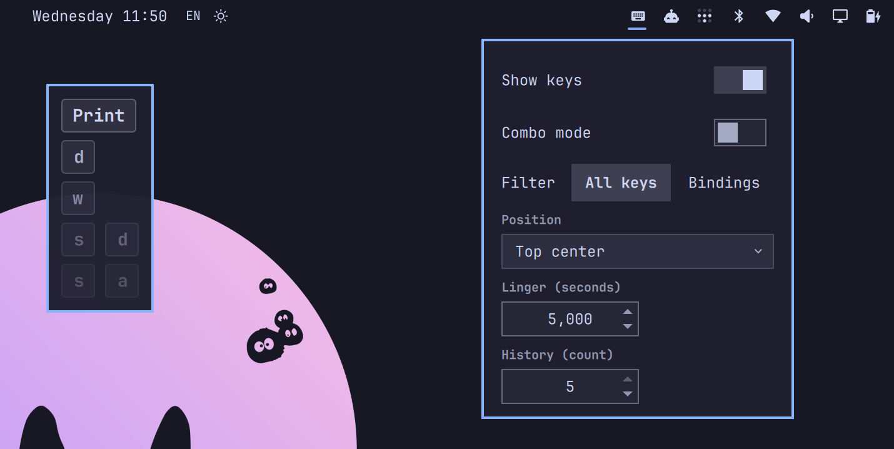

# Omarchy Key Visualizer

A tiny [Omarchy](https://omarchy.org/) plugin that shows the keys you press
on screen. No keycap images, no animations — just the characters and
combinations, rendered with the shell's own styles, appearing while a key is
held and lingering briefly after release.

Built for keybinding tutorials and screencasts: Omarchy is a keybinding-heavy
desktop, so a combo like `Super + Shift + G` shows up as three small chips
at the bottom of the screen.

## Preview



## How it works

| Piece          | Where it runs                              | What it does |
|----------------|--------------------------------------------|--------------|
| `key-visualizer.lua`| Hyprland Lua config (inside the compositor)| Listens to `input.keyboard.key`, tracks the pressed combo, writes it to `$XDG_RUNTIME_DIR/omarchy-key-visualizer.json` |
| `KeyVisualizer.qml`| Quickshell `omarchy-shell` (keep-loaded panel)| Watches the state file and renders the chips |
| `BarWidget.qml`| Quickshell bar (per monitor)               | Keyboard glyph that pauses/resumes the display |

No background daemons, no special permissions, no extra packages: the
compositor is already the source of truth for keys, and the shell is already
running.

## Install

Validate the folder first (optional but handy for plugin authors):

```bash
omarchy plugin validate ./omarchy-key-visualizer
```

Then add it — a local path works as well as a git URL (`plugin add` clones
with git, and `git clone` accepts local paths):

```bash
omarchy plugin add /path/to/omarchy-key-visualizer --enable
# or once published:
# omarchy plugin add https://github.com/YOU/omarchy-key-visualizer --enable
```

`--enable` enables it right away; without it, enable later with
`omarchy plugin enable felixzsh.key-visualizer`. The plugin is a panel and a bar
widget: the panel shows the keys, and the bar widget is a toggle — enable
prompts for its bar section (or pass `--section right`). If you added from a
local path, `omarchy plugin update felixzsh.key-visualizer` pulls your local
changes into the installed copy.

That's the whole install: on first load the panel appends a small guarded
block to `~/.config/hypr/hyprland.lua` that loads the capture script into
Hyprland's Lua config, and Hyprland auto-reloads on save. Nothing else to
do — no manual edits, no `hyprctl reload`.

### Requirements

- Hyprland with Lua config support (0.56+), as shipped by Omarchy.
- The plugin enabled in the shell (done above).

## Bar widget

The keyboard glyph in the bar (right section by default) opens a small
menu, following the native bar-widget pattern:

- **Show keys** — toggle that pauses/resumes the display (useful mid-demo).
  The glyph button itself does not toggle; the menu does.
- **Mode** — `All keys` or `Bindings only` (only combos with a modifier).
- **Position** — a dropdown with all nine placements (top/middle/bottom
  × left/center/right) of the screen.
- **Linger** — a numeric field (wheel, +/− buttons, or typing) for how long
  a released combo stays, 0–10s in 500ms steps; `0` keeps the last combo on
  screen until the next key.

The menu writes the same pause flag and `config.json` that the display
panel watches, so it stays in sync across monitors. You can also drive it
over IPC (routed to the display panel):

```bash
omarchy-shell key-visualizer toggle
omarchy-shell key-visualizer pause
omarchy-shell key-visualizer resume
omarchy-shell key-visualizer paused   # true | false
```

Move the glyph with `omarchy bar move felixzsh.key-visualizer --section left`
(or right/center).

### After installing: no restart needed

If the glyph does not appear in the bar right after `omarchy plugin enable`,
run a plugin rescan instead of restarting the whole shell:

```bash
omarchy-shell shell rescanPlugins
```

The shell's enable flow persists the bar layout before it registers new
third-party widgets (a shell-side ordering detail, not specific to this
plugin); a rescan registers them.

**One caveat**: the plugin reload pipeline is debounced and can leave a
stale component in the running shell — especially after rapid uninstall +
reinstall cycles or editing plugin files. If a change you deployed does not
take effect (old behavior persists), run `omarchy restart shell` once; that
unconditionally loads everything from disk. This applies to any third-party
plugin, not just this one.

## Behavior

- **Typing** — shows just the character: `g`, `G`, `!`, `5`.
- **Modifier combos** — shows every modifier plus the key: `Super Shift G`,
  `Ctrl C`, `Super Enter`.
- **Combos are a unit** — a combination stays intact no matter the order you
  release it: press `Ctrl Shift N`, let go of `Ctrl` first, then `Shift`,
  then `N`, and the display keeps showing `Ctrl Shift N` the whole time
  (keyviz shrinks key-by-key; this plugin treats the chord as one unit).
- **Non-printing keys** — labeled: `Esc`, `Tab`, `F1`, arrows, `Space`.
- Modifiers that produce the shifted character (`Shift` with a letter) are
  folded into the character itself: `Shift + 1` shows `!`.
- Key repeat is ignored; a held key shows once.
- After the last key is released the combo lingers briefly (1s by default,
  keyviz-style "Duration") and then vanishes in one frame — no fade. The
  lingering combo is always the last full one, never a partial release state.
  `lingerMs: 0` means "always show": the last combo stays on screen until
  the next key replaces it.
- **History** (`historyCount`, 1–5, default 1) — the last few combos stack
  on screen instead of vanishing. Each new combo pushes the previous one
  down the stack; the current combo is fully opaque and every older entry
  fades step by step, so a `Super + G` → `Super + Shift + G` sequence shows
  both, with the older one visibly dimmer. The stack direction follows the
  position: top positions grow downward (newest on top), bottom positions
  grow upward (newest at the bottom edge) — not configurable, by design.
  With `lingerMs: 0` entries never expire, so the stack keeps the last few
  combos on screen until newer ones push them out.
- **Combo mode** (toggle in the panel, `comboMode` in config) — turns the
  display into a game-style counter. Chords that contain a modifier
  (`Super`, `Ctrl`, `Alt`, `Shift`, `Menu`, `AltGr`) are **combos**: they
  build a combo counter, apply a multiplier (`×2` at 5, `×3` at 10, … up to
  `×8` at 50) and escalate the effects. Plain characters (and shifted chars
  typed alone, which render as the character itself) are **hits**: +10
  score only, they never touch the combo counter. Scoring:
  `hit = +10`, `combo = (20 + 15×(mods−1) + 5×(keys−1)) × multiplier`.
  The banner (`COMBO 12 ×3 · 3,450`) sits below the history for bottom
  positions and above it for top positions, with a floating `+N` pop per
  press. Effects scale with modifiers and chain length: banner pulse,
  hue shift, screen shake (up to 5px) and, at 10+ combos, continuous hue
  cycling — at 20+, a constant subtle vibration while the combo is hot.
  The combo counter resets after `comboWindowMs` (2s) without a new combo,
  and when the linger window then passes (the display clears) the **score
  resets with it**, so every run starts from zero. A chord made only of
  modifiers (`Super` alone, `Super+Ctrl+Shift`) is not a valid combo —
  modifiers of nothing — and scores zero; a valid combo always ends on a
  non-modifier key. Counted once
  per physical chord (on release), so growing key presses never double-count.
- In `mode: "bindings"` only combos with a modifier are shown; plain typing
  stays off screen.

## Customize

Options live in `~/.config/omarchy/key-visualizer.json` (created with the
defaults below on first run). It sits **outside** the plugin folder on
purpose: the shell reloads all plugin code whenever any file under
`~/.config/omarchy/plugins/` changes, so a config file there would restart
the plugin on every edit. Editing this file updates the display live:

```json
{
  "mode": "all",
  "position": "bottom-center",
  "margin": 67,
  "lingerMs": 1000,
  "historyCount": 1,
  "comboMode": false
}
```

| Option         | Values                                             | Default         |
|----------------|----------------------------------------------------|-----------------|
| `mode`         | `all` or `bindings` (only combos with a modifier)  | `all`           |
| `position`     | six placements: `top-left` … `bottom-right` (middle positions were dropped; the stack anchors to the top or bottom edge) | `bottom-center` |
| `margin`       | px from the screen edge                            | `67`            |
| `lingerMs`     | ms a released combo stays; `0` keeps it until the next key (keyviz defaults to `5000`) | `1000`       |
| `historyCount` | how many combos stack on screen (1–5); older entries fade | `1`         |
| `comboMode`    | `true`/`false` — game-style combo counter, score and effects | `false`      |

Deeper tweaks still live in the QML/Lua sources:

| Want to change...                 | Edit                                    |
|-----------------------------------|-----------------------------------------|
| Chip font / padding               | `chipFont`, `chipPadX/Y` in `KeyVisualizer.qml` |
| Key labels or layout mapping      | `KEYS` / `CHARS` / `SHIFTED` tables in `key-visualizer.lua` |

The key tables use **US layout** keycode mapping. Letters and digits match
most layouts; on other layouts, symbol keys (`;`, `[`, `ñ`, …) may show the
US glyph or fall back to the key name. Dead keys and compose sequences are
not expanded.

## Status

`omarchy-shell key-visualizer ping` — health check.
`omarchy-shell key-visualizer state` — `open` while a combo is on screen.

## Roadmap

- Layout-aware keysyms via `xkbcommon` instead of the static US table.
- Per-monitor placement.

## License

MIT
